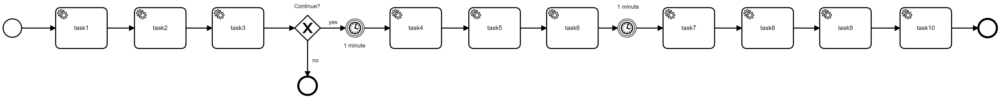
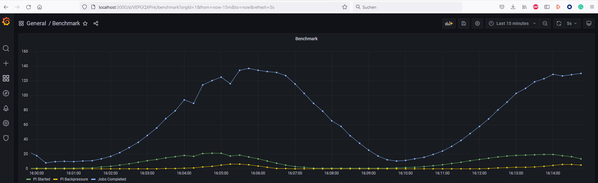

[](https://github.com/camunda-community-hub/community)  [](https://github.com/Camunda-Community-Hub/community/blob/main/extension-lifecycle.md#incubating-)

# Camunda 8 Benchmark (c8b)

Spring Boot project to run benchmarks on Camunda Platform 8.

The project 

* Starts process instances at a given rate
* The rate will be adjusted based on backpressure, so it should find a sustainable starter rate automatically
* Completes tasks in the processes

You can find a blog post describing this benchmarks in more detail here: [How to Benchmark Your Camunda 8 Cluster](https://blog.bernd-ruecker.com/how-to-benchmark-your-camunda-8-cluster-48ada4b047b6).

# Plan for the right environment!

When running benchmarks, please make sure to use a realistic environment that can take your load, see also [Sizing your environment](https://docs.camunda.io/docs/components/best-practices/architecture/sizing-your-environment/).

A good environment

* is **not** a SaaS trial, as it contains limited resources and you might hit a bottleneck early on.
* does **not** run all Camunda components on a developer machine, as this will not produce meaningful results.
* is either setup in Camunda SaaS with a Camunda representive helping you to get a resonable sized cluster
* or provisioned [self-managed](https://docs.camunda.io/docs/next/self-managed/platform-deployment/overview/#deployment-recommendation) in a properly sized environment.

# How-to run

You only need to run this one application for driving your benchmark, but you might scale this application if you need to produce more load to utilize your cluster(you might want to adjust the `benchmark.startPiReduceFactor` of the properties as backpressure is then "distributed" over various load generators)


```bash
mvn spring-boot:run
```

Or 
```bash
docker run camundacommunityhub/camunda-8-benchmark:main
```

You can configure 

- everything [Spring Zeebe](https://github.com/camunda-community-hub/spring-zeebe) understands
- additional parameters for the benchmark as listed below

The most common parameters to adjust are:

- The BPMN process model itself, which might also mean you have to adjust the bpmnProcessId of processes being started and the taskType of service tasks being worked on.
- The `taskCompletionDelay`, simulating how long a service task typically takes.
- The `payload`, which shall be passed to your process instances.
- The `processInstanceStartRate` to begin with. While this is adjusted, a realistic start value makes the benchmark quicker to yield a stable result.
- If workers shall be started (`startWorkers`). If set to false, the benchmark will only start process instances, not start any workers.
- If all jobs shall be of the same type, of if multiple types will be used (`multipleJobTypes`). If set to 0, only one worker is started for job type `benchmark-task` (unless the name is overwritten), otherwise, there is the configured number of workers started, e.g. if set to 2, it will start workers for `benchmark-test-1` and `benchmark-test-2`. We noticed that changing to use a 8 unique job types (different job type for each service task) allowed the gateway to distribute the work more evenly across brokers. There is a measurable improvement in performance and it is more realistic, so it is actually recommended.
- `fixedBackOffDelay`:  When set to 0, will default to Exponential Backoff Delay. Otherwise, specify fixed number of millis backoff
- `startRateAdjustmentStrategy` can be `backoff` or `none` - when set to none, the start rate is constant  

# Define your process and payload

You can define your own models and payload. You could for example create a public Gist on Github to directly use it, for example:

```properties
benchmark.bpmnResource=url:https://gist.githubusercontent.com/berndruecker/7a40738c43de5886b42c910cc91fd866/raw/66d5250be962f9b8083be9b0431ceced4988d902/bpmn-for-dmn-benchmark.bpmn,classpath:bpmn/complex_decision.dmn
benchmark.bpmnProcessId=benchmark-dmn
benchmark.payloadPath=url:https://gist.githubusercontent.com/berndruecker/ec94642075548d2c84404336d77ea6f1/raw/11cd080fd387c2de64e0e718bedf25f4412f0981/data.json
```

## Typical process

If you do not specify a process model, the [typical process](blob/main/src/main/resources/bpmn/typical_process.bpmn) is used as a process model showing a typical model size we see at customers (around 10 to 30 tasks). It is intentional, that there are not much other elements (like gateways or events), as this did not influence benchmark too much in our experiments, so we preferred to keep it simple.



## Defining your own process

You can also define your own process model completely, but it has to comply with the following requirements:

- All service tasks must have the same ``service task type``, if this is not `benchmark-task` you have to configure the task type via `benchmark.jobType`
- You must add ``-completed`` to the task type of the last service task:

```xml
 <bpmn:serviceTask id="lastTask">
  <bpmn:extensionElements>
    <zeebe:taskDefinition type="benchmark-task-completed" />
  </bpmn:extensionElements>
```

This allows the benchmark to measure the cycle time. While this is not a 100% correct, it is a good approximation and sufficient for typical load tests.

With this process model you need to

1. Make sure it is deployed: You can either deploy it yourself to the cluster, or set ``benchmark.bpmnResource`` accordingly (it is a Spring resource)
2. Make sure it is used and configure ``benchmark.bpmnProcessId`` to your process Id.


### Sticky processes 

You can tie a process to one cluster instance of the starter (in case you need to scale those). Therefore, you need to makre sure the following configuration property is set differently for every starter instance (e.g. by using environment variables to overwrite it):

```properties
benchmark.starterId=benchmarkStarter1
```

Now you can use that startedId in your process models to tie service tasks to this instance of your starter by using the `benchmark_starter_id` process variable:

```xml
 <bpmn:serviceTask id="task1" name="task1">
  <bpmn:extensionElements>
    <zeebe:taskDefinition type="= &#34;benchmark-task-&#34; + benchmark_starter_id" />
  </bpmn:extensionElements>
```

Normally you simply configure the task type via the modeler:

```
= "benchmark-task-" + benchmark_starter_id
```


## Configuration Properties

See https://github.com/camunda-community-hub/camunda-8-benchmark/blob/main/src/main/resources/application.properties


## Thoughts on load generation

### Job Acquisition, Job Completion, and Process Start

The benchmark project starts all three types of work: acquire jobs, complete those jobs and start new process instances. The different work items compete for resources on the broker.

The current configuration gives maximum priority to jobs, as it is important that all open tasks can be completed. Otherwise open tasks will pile up and you eventually might never catch up.

Zeebe itself whitelists job completions on backpressure, which means, no backpressure ever on job completions. That also means, whenever the system is busy with tasks/jobs, no process instances can be started, as this will experience a lot of backpressure.

### Synchronous And Asynchronous Work


Everything in this benchmark project is executed asynchronously using various schedulers and thread pools.

Overall, the code itself does not do very compute intensive things, but basically waits for network I/O most of the time. By using asynchronous/reactive programming, one application should be able to produce a lot of load. 

As a consequence, no synchronous code is used, and also ``waitForResults`` from Zeebe is not used at all.

### Do we need backpressure and what's an acceptable limit?

When you try to optimize for cluster throughput you want to get a number what a specific cluster can do (focusing on Zeebe for the moment). To get the maximum throughput you need some backpressure, otherwise you are not working at the limit. This is the "how far can we push this perspective".
The current assumption is 10% of backpressure gets us there.

A normal user would probably strive for 0% backpressure. If we accept only 0.5 % backpressure, we  still know that if we increase the start rate just a little bit, backpressure will kick in.

The "target" backpressure can be configured:

```properties
benchmark.maxBackpressurePercentage=10.0
```

# Collect and inspect metrics

The application provides some metrics via Spring Actuator that can be used via http://localhost:8088/actuator/prometheus for Prometheus.

To work locally, this project contains a docker-compose file that starts up a prometheus/grafana combo which scrapes the local Java application:  

```
cd grafana
docker compose up
```

Now you can inspect metrics:

* via Prometheus, e.g. http://localhost:9090/graph?g0.expr=startedPi_total&g0.tab=0&g0.stacked=0&g0.show_exemplars=0&g0.range_input=1h 
* via Grafana, e.g. http://localhost:3000/d/VEPGQXPnk/benchmark?orgId=1&from=now-15m&to=now




# Run Starter via Kubernetes

You need a Kubernetes cluster, e.g. on GCP:

````bash
gcloud init
gcloud container clusters get-credentials bernd-benchmark --zone europe-west1-b

````

In order to see something, install Prometheus and Grafana

````bash
kubectl apply -k k8s/ -n monitoring
````

You can use port forwarding to access those tools:

```bash
kubectl --namespace monitoring port-forward svc/prometheus-service 9090
kubectl --namespace monitoring port-forward svc/grafana 3000
```

* http://localhost:9090/
* http://localhost:3000/

Now you can run the benchmark starter via Kubernetes. First, make sure to set the right configuration in the YAML file to connect to your cluster:

````bash
kubectl apply -f k8s/benchmark.yaml
````


# Todos and open issues

- Extract stuff so that it can be used as library and provide an example (Benchmark Starter), own code for startzing and job completion (but recognize/handle backpressure)
- Document properties and examples
  - Process Model from URL
  - Payload from URL
  - Pool Size Parameters
- Add message correlation
- Get information about job activation back pressure / Check if we need to look at JobActivation-Backoff?
```log
09:19:23.695 [grpc-default-executor-168] WARN  io.camunda.zeebe.client.job.poller - Failed to activated jobs for worker default and job type benchmark-task-benchmarkStarter1
  io.grpc.StatusRuntimeException: DEADLINE_EXCEEDED: deadline exceeded after 19.999980100s. [closed=[UNAVAILABLE], committed=[remote_addr=3e93d2f8-adf2-4d45-86f6-19581c016972.bru-3.zeebe.ultrawombat.com/34.76.29.41:443]]
  at io.grpc.Status.asRuntimeException(Status.java:535)
  at io.grpc.stub.ClientCalls$StreamObserverToCallListenerAdapter.onClose(ClientCalls.java:479)
  at io.grpc.internal.ClientCallImpl.closeObserver(ClientCallImpl.java:562)
  at io.grpc.internal.ClientCallImpl.access$300(ClientCallImpl.java:70)
  at io.grpc.internal.ClientCallImpl$ClientStreamListenerImpl$1StreamClosed.runInternal(ClientCallImpl.java:743)
  at io.grpc.internal.ClientCallImpl$ClientStreamListenerImpl$1StreamClosed.runInContext(ClientCallImpl.java:722)
  at io.grpc.internal.ContextRunnable.run(ContextRunnable.java:37)
  at io.grpc.internal.SerializingExecutor.run(SerializingExecutor.java:133)
  at java.base/java.util.concurrent.ThreadPoolExecutor.runWorker(ThreadPoolExecutor.java:1136)
  at java.base/java.util.concurrent.ThreadPoolExecutor$Worker.run(ThreadPoolExecutor.java:635)
  at java.base/java.lang.Thread.run(Thread.java:833)
```

# Building and using an own version of the Docker image

1. To build the docker image you can run `docker build . --tag gcr.io/camunda-researchanddevelopment/falko-camunda-8-benchmark:0.0.1-SNAPSHOT`
2. Then you can push the image: `docker push 'gcr.io/camunda-researchanddevelopment/falko-camunda-8-benchmark:0.0.1-SNAPSHOT'`
