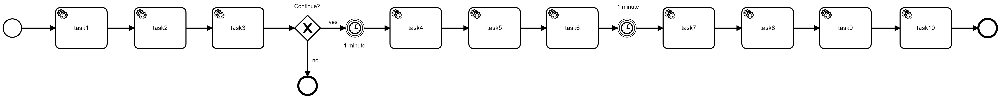
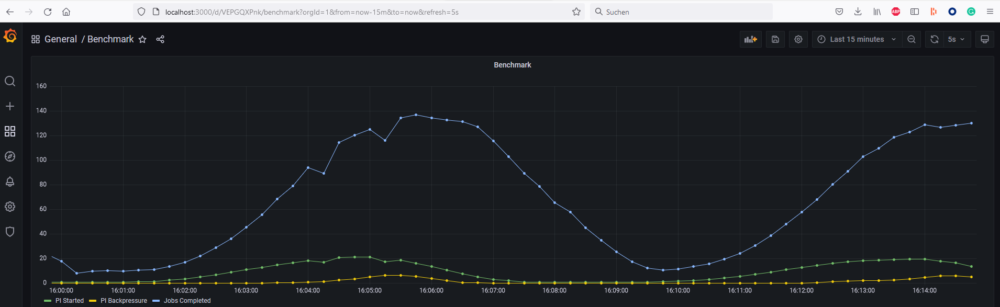

[](https://github.com/Camunda-Community-Hub/community/blob/main/extension-lifecycle.md#incubating-)
[](https://github.com/camunda-community-hub/community)


# Camunda 8 Benchmark (c8b)

Spring Boot project to run benchmarks on Camunda Platform 8.

The project 

* Starts process instances at a given rate
* The rate will be adjusted based on backpressure, so it should find a sustainable starter rate automatically
* Completes tasks in the processes

You can find a blog post describing this benchmarks in more detail here: [How to Benchmark Your Camunda 8 Cluster](https://blog.bernd-ruecker.com/how-to-benchmark-your-camunda-8-cluster-48ada4b047b6).

# Plan for the right environment!

When running benchmarks, please make sure to use a realistic environment that can take your load, see also [Sizing your environment](https://docs.camunda.io/docs/components/best-practices/architecture/sizing-your-environment/).

A good environment

* is **not** a SaaS trial, as it contains limited resources and you might hit a bottleneck early on.
* does **not** run all Camunda components on a developer machine, as this will not produce meaningful results.
* is either setup in Camunda SaaS with a Camunda representive helping you to get a resonable sized cluster
* or provisioned [self-managed](https://docs.camunda.io/docs/next/self-managed/platform-deployment/overview/#deployment-recommendation) in a properly sized environment.

# How-to run

You only need to run this one application for driving your benchmark, but you might configure/scale this application if you need to produce more load to utilize your cluster(you might want to adjust the `benchmark.startPiReduceFactor` of the properties as backpressure is then "distributed" over various load generators)


```bash
mvn spring-boot:run
```

or using the [docker image](https://hub.docker.com/r/camundacommunityhub/camunda-8-benchmark):
```bash
docker run camundacommunityhub/camunda-8-benchmark:main
```

To override `benchmark.*`/`camunda.client.*` properties without baking your own image, pass them as JVM system properties via the `JAVA_TOOL_OPTIONS` environment variable — the JVM reads that variable itself, so it works no matter how the container's entrypoint invokes `java`:
```bash
docker run -e JAVA_TOOL_OPTIONS="-Dbenchmark.startPiPerSecond=100 -Dcamunda.client.grpc-address=http://your-zeebe-gateway:26500" camundacommunityhub/camunda-8-benchmark:main
```

You can configure 

- everything [Spring Zeebe](https://github.com/camunda-community-hub/spring-zeebe) understands
- additional parameters for the benchmark as listed below

The most common parameters to adjust are:

- The BPMN process model itself, which might also mean you have to adjust the bpmnProcessId of processes being started and the taskType of service tasks being worked on.
- The `taskCompletionDelay`, simulating how long a service task typically takes.
- The `payload`, which shall be passed to your process instances.
- The `processInstanceStartRate` to begin with. While this is adjusted, a realistic start value makes the benchmark quicker to yield a stable result.
- If workers shall be started (`startWorkers`). If set to false, the benchmark will only start process instances, not start any workers.
- If all jobs shall be of the same type, of if multiple types will be used (`multipleJobTypes`). If set to 0, only one worker is started for job type `benchmark-task` (unless the name is overwritten using `jobType`), otherwise, there is the configured number of workers started, e.g. if set to 2, it will start workers for `benchmark-test-1` and `benchmark-test-2`. We noticed that changing to use a 8 unique job types (different job type for each service task) allowed the gateway to distribute the work more evenly across brokers. There is a measurable improvement in performance and it is more realistic, so it is actually recommended.
- `fixedBackOffDelay`:  When set to 0, will default to Exponential Backoff Delay. Otherwise, specify fixed number of millis backoff
- `startRateAdjustmentStrategy` can be `backoff` or `none` - when set to none, the start rate is constant  

# Define your process and payload

You can define your own models and payload. You could for example create a public Gist on Github to directly use it, for example:

```properties
benchmark.bpmnResource=url:https://gist.githubusercontent.com/berndruecker/7a40738c43de5886b42c910cc91fd866/raw/66d5250be962f9b8083be9b0431ceced4988d902/bpmn-for-dmn-benchmark.bpmn,classpath:bpmn/complex_decision.dmn
benchmark.bpmnProcessId=benchmark-dmn
benchmark.payloadPath=url:https://gist.githubusercontent.com/berndruecker/ec94642075548d2c84404336d77ea6f1/raw/11cd080fd387c2de64e0e718bedf25f4412f0981/data.json
```

You can adjust the model on the fly, for example because you want to replace specific service task types with the `benchmark` task type mocked by the benchmark project (instead of calling the sendgrid connecter in the example below). Also you can replace the process id with `benchmark` automatically:

```poperties
benchmark.jobTypesToReplace=io.camunda:sendgrid:1
benchmark.bpmnProcessIdToReplace=Process_145kw8o
```

## Typical process

If you do not specify a process model, the [typical process](blob/main/src/main/resources/bpmn/typical_process.bpmn) is used as a process model showing a typical model size we see at customers (around 10 to 30 tasks). It is intentional, that there are not much other elements (like gateways or events), as this did not influence benchmark too much in our experiments, so we preferred to keep it simple.



## Defining your own process

You can also define your own process model completely. The benchmark application **automatically discovers and registers job workers for static job types defined in your BPMN files**, making configuration much simpler.

### Automatic Job Type Discovery

The application uses the Zeebe BPMN Model API to parse your BPMN files and automatically extract static service task job types. This means:

- **No manual configuration needed**: Job workers are automatically registered for all static job types found in your BPMN
- **Supports static job types only**: e.g., `"benchmark-task-1"`, `"benchmark-task-2"`
- **Ignores dynamic expressions**: Dynamic expressions like `"benchmark-task-" + benchmark_starter_id` are ignored since they are already covered by automatic worker registrations
- **Backward compatible**: Falls back to configuration-based job types if BPMN parsing fails

For each discovered static job type, the system automatically registers a worker for that exact job type.

### Manual Configuration of Job Types

If you prefer manual configuration or need to override the automatic discovery, you can still configure job types manually:

- All service tasks must have the same ``service task type``, if this is not `benchmark-task` you have to configure the task type via `benchmark.jobType`
- You must add ``-completed`` to the task type of the last service task:

```xml
 <bpmn:serviceTask id="lastTask">
  <bpmn:extensionElements>
    <zeebe:taskDefinition type="benchmark-task-completed" />
  </bpmn:extensionElements>
```

This allows the benchmark to measure the cycle time. While this is not a 100% correct, it is a good approximation and sufficient for typical load tests.

With this process model you need to

1. Make sure it is deployed: You can either deploy it yourself to the cluster, or set ``benchmark.bpmnResource`` accordingly (it is a Spring resource)
2. Make sure it is used and configure ``benchmark.bpmnProcessId`` to your process Id.


### Sticky processes 

You can tie a process to one instance of the starter (in case you need to scale those). Therefore, you need to makre sure the following configuration property is set differently for every starter instance (e.g. by using environment variables to overwrite it):

```properties
benchmark.starterId=benchmarkStarter1
```

Now you can use that startedId in your process models to tie service tasks to this instance of your starter by using the `benchmark_starter_id` process variable:

```xml
 <bpmn:serviceTask id="task1" name="task1">
  <bpmn:extensionElements>
    <zeebe:taskDefinition type="= &#34;benchmark-task-&#34; + benchmark_starter_id" />
  </bpmn:extensionElements>
```

Normally you simply configure the task type via the modeler:

```
= "benchmark-task-" + benchmark_starter_id
```


## Configuration Properties

See https://github.com/camunda-community-hub/camunda-8-benchmark/blob/main/src/main/resources/application.properties

## Bucket4j Flow Control Strategies

Two additional rate adjustment strategies are available using [Bucket4j](https://bucket4j.com/) and Java 21 virtual threads. They replace the traditional 10ms batch scheduling loop with a simpler model: a virtual thread consumes tokens from a token bucket to pace process instance creation.

Only the PI-starting path (`benchmark.startProcesses`) has a Bucket4j-based scheduler. `benchmark.startDecisions=true` (DMN load testing) is not supported together with `backoff`/`autoTune`/`autoTuneJobRatio` and stays disabled while any of them is selected.

### `backoff` — Fixed Rate with Backpressure Penalty

Runs at the configured `startPiPerSecond` rate. When `RESOURCE_EXHAUSTED` is received from Zeebe, the token bucket is penalized (tokens drained proportional to `startPiReduceFactor`), temporarily reducing the effective rate. The rate recovers automatically as tokens refill.

```properties
benchmark.startRateAdjustmentStrategy=backoff
benchmark.startPiPerSecond=500
benchmark.startPiReduceFactor=0.1
```

### `autoTune` — Automatic Rate Discovery

Starts at `startPiPerSecond` and periodically adjusts the rate to match what the cluster can handle, using a TCP-style **slow-start followed by AIMD** (additive-increase/multiplicative-decrease) search: it grows the rate exponentially (fast) until the *first* tick where backpressure exceeds `maxBackpressurePercentage`, then assumes the cluster's ceiling is roughly fixed for the rest of the run — cutting hard on that first congestion event and permanently switching to small, fixed additive steps for any further increases from then on. This bounds how far a single misleadingly-healthy tick can push the rate; the alternative (always-exponential growth) has no such bound and can compound into runaway overshoot in minutes.

```properties
benchmark.startRateAdjustmentStrategy=autoTune
benchmark.startPiPerSecond=500
benchmark.startPiReduceFactor=0.1
benchmark.startPiIncreaseFactor=0.4
benchmark.maxBackpressurePercentage=10.0
```

### How It Works

1. **A virtual thread** consumes tokens from a Bucket4j bucket, running a simple loop: acquire token → start process instance → repeat. A single thread is enough because starting a process instance is fire-and-forget (async, non-blocking), so throughput is governed entirely by the token bucket, not by how many threads poll it.
2. **The bucket's refill rate** equals `startPiPerSecond`, controlling throughput.
3. **A gRPC interceptor** detects `RESOURCE_EXHAUSTED` responses and penalizes the bucket, immediately slowing down the waiting thread. Note that this interceptor is registered on the whole client, not just PI-start calls — see the caveat about `startDecisions` above.
4. **For `autoTune`:** a periodic adjuster (every 10s) reads the PI-start and PI-backpressure one-minute rates from the same metrics the classic `backpressure` strategy uses (rolling rates, not a hard-reset counter, so a slow-to-resolve rejection still counts toward the window it was actually sent in). While no congestion has been seen yet, it grows the rate exponentially (`* (1 + startPiIncreaseFactor)`); once backpressure first exceeds `maxBackpressurePercentage`, it cuts the rate (`* (1 - startPiReduceFactor)`) and permanently switches to additive steps (`+ startPiPerSecond * startPiIncreaseFactor` per tick) for the rest of the run — this assumes the target cluster's capacity is roughly fixed for a single benchmark run.

### `autoTuneJobRatio` — Rate Discovery via Job Completion Rate

Same slow-start-then-AIMD search as `autoTune`, but driven by a different, generally more reliable signal: whether **job completions** are keeping pace with PI starts, instead of gRPC backpressure on the PI-start command itself.

The problem this solves: Zeebe can accept and persist `CreateProcessInstance` commands (a cheap log append) far faster than it can actually activate, execute, and export the resulting jobs (expensive). That means `RESOURCE_EXHAUSTED` on the *start* command specifically can lag badly behind real engine saturation — `autoTune` may see a "healthy" tick long after the engine has already fallen behind. For a deployed process with `N` distinct job types, a healthy pipeline completes roughly `N` jobs for every PI started; if the observed job-completion rate drops below `minJobCompletionRatio` of that expectation, `autoTuneJobRatio` treats that as congestion, the same way `autoTune` treats high backpressure.

```properties
benchmark.startRateAdjustmentStrategy=autoTuneJobRatio
benchmark.startPiPerSecond=500
benchmark.startPiReduceFactor=0.1
benchmark.startPiIncreaseFactor=0.4
benchmark.minJobCompletionRatio=0.8
```

**Limitations:**
- Requires this same instance to also run job workers for the deployed process (the common single-replica benchmark setup). A "starter-only" replica (`benchmark.startWorkers=false`, used in "sticky" multi-starter deployments) has no local job completions to measure and should use `autoTune`/`backoff` instead.
- Requires at least one job type. A process with none has nothing to measure against — c8b logs a warning at startup and never adjusts the rate in that case; use `autoTune`/`backoff` for job-less processes (this is why it's a separate strategy rather than a mode of `autoTune`).
- `N` (jobs per instance) is derived once at startup from the same job-type discovery `JobWorker` already does (BPMN parsing plus `benchmark.jobType`/`multipleJobTypes`), so it inherits that logic's one existing quirk: when relying purely on BPMN auto-discovery (no explicit `benchmark.jobType` matching a real task), the unused default `jobType` config value still contributes one extra count. `minJobCompletionRatio`'s default (0.8) has some slack built in, but for processes with very few tasks this may need adjusting.

### Comparison of Strategies

| Feature | `none` | `backpressure` | `backoff` | `autoTune` | `autoTuneJobRatio` |
|---------|--------|---------------|-----------|------------|--------------------|
| Rate control | Fixed | 30s polling loop | Token bucket | Token bucket | Token bucket |
| Backpressure response | None | Adjusts goal rate | Immediate penalty | Immediate penalty + rate adjustment | Immediate penalty + rate adjustment |
| Rate can increase | No | Yes | No | Yes | Yes |
| Adjustment signal | — | gRPC backpressure | gRPC backpressure | gRPC backpressure | Job completion rate |
| Concurrency model | Thread pool + @Async | Thread pool + @Async | 1 virtual thread | 1 virtual thread | 1 virtual thread |

### Testing

The `backoff`/`autoTune`/`none`/`backpressure` strategies are covered by `*IT` integration tests (e.g. `FlowControlIntegrationIT`, `NoneStrategyIT`, `BackpressureStrategyIT`) that spin up a real Zeebe engine via `camunda-process-test-spring`/Testcontainers. These run as part of `mvn clean verify` (via `maven-failsafe-plugin`), so **Docker must be running** for that command to succeed — this is a new requirement introduced alongside this feature; previously `mvn clean verify` had no Docker dependency. Each `*IT` class starts its own container (roughly 20-50s), adding a couple of minutes to local/CI build time. `autoTuneJobRatio`'s bean-activation is covered by the lightweight, Docker-free `FlowControlConditionalBeanTest`; its rate-adjustment algorithm is covered by `Bucket4jPiSchedulerTest` (same as `autoTune`).


## Thoughts on load generation

### Job Acquisition, Job Completion, and Process Start

The benchmark project starts all three types of work: acquire jobs, complete those jobs and start new process instances. The different work items compete for resources on the broker.

The current configuration gives maximum priority to jobs, as it is important that all open tasks can be completed. Otherwise open tasks will pile up and you eventually might never catch up.

Zeebe itself whitelists job completions on backpressure, which means, no backpressure ever on job completions. That also means, whenever the system is busy with tasks/jobs, no process instances can be started, as this will experience a lot of backpressure.

### Synchronous And Asynchronous Work


Everything in this benchmark project is executed asynchronously using various schedulers and thread pools.

Overall, the code itself does not do very compute intensive things, but basically waits for network I/O most of the time. By using asynchronous/reactive programming, one application should be able to produce a lot of load. 

As a consequence, no synchronous code is used, and also ``waitForResults`` from Zeebe is not used at all.

### Do we need backpressure and what's an acceptable limit?

When you try to optimize for cluster throughput you want to get a number what a specific cluster can do (focusing on Zeebe for the moment). To get the maximum throughput you need some backpressure, otherwise you are not working at the limit. This is the "how far can we push this perspective".
The current assumption is 10% of backpressure gets us there.

A normal user would probably strive for 0% backpressure. If we accept only 0.5 % backpressure, we  still know that if we increase the start rate just a little bit, backpressure will kick in.

The "target" backpressure can be configured:

```properties
benchmark.maxBackpressurePercentage=10.0
```

# Collect and inspect metrics

The application provides some metrics via Spring Actuator that can be used via http://localhost:8088/actuator/prometheus for Prometheus.

To work locally, this project contains a docker-compose file that starts up a prometheus/grafana combo which scrapes the local Java application:  

```
cd grafana
docker compose up
```

Now you can inspect metrics:

* via Prometheus, e.g. http://localhost:9090/graph?g0.expr=startedPi_total&g0.tab=0&g0.stacked=0&g0.show_exemplars=0&g0.range_input=1h 
* via Grafana, e.g. http://localhost:3000/d/VEPGQXPnk/benchmark?orgId=1&from=now-15m&to=now




# Run Starter via Kubernetes

You need a Kubernetes cluster, e.g. on GCP:

````bash
gcloud init
gcloud container clusters get-credentials bernd-benchmark --zone europe-west1-b

````

In order to see something, install Prometheus and Grafana

````bash
kubectl apply -k k8s/ -n monitoring
````

You can use port forwarding to access those tools:

```bash
kubectl --namespace monitoring port-forward svc/prometheus-service 9090
kubectl --namespace monitoring port-forward svc/grafana 3000
```

* http://localhost:9090/
* http://localhost:3000/

Now you can run the benchmark starter via Kubernetes. First, make sure to set the right configuration in the YAML file to connect to your cluster:

````bash
kubectl apply -f k8s/benchmark.yaml
````


# Todos and open issues

- Extract stuff so that it can be used as library and provide an example (Benchmark Starter), own code for startzing and job completion (but recognize/handle backpressure)
- Document properties and examples
  - Process Model from URL
  - Payload from URL
  - Pool Size Parameters
- Add message correlation
- Get information about job activation back pressure / Check if we need to look at JobActivation-Backoff?
```log
09:19:23.695 [grpc-default-executor-168] WARN  io.camunda.zeebe.client.job.poller - Failed to activated jobs for worker default and job type benchmark-task-benchmarkStarter1
  io.grpc.StatusRuntimeException: DEADLINE_EXCEEDED: deadline exceeded after 19.999980100s. [closed=[UNAVAILABLE], committed=[remote_addr=3e93d2f8-adf2-4d45-86f6-19581c016972.bru-3.zeebe.ultrawombat.com/34.76.29.41:443]]
  at io.grpc.Status.asRuntimeException(Status.java:535)
  at io.grpc.stub.ClientCalls$StreamObserverToCallListenerAdapter.onClose(ClientCalls.java:479)
  at io.grpc.internal.ClientCallImpl.closeObserver(ClientCallImpl.java:562)
  at io.grpc.internal.ClientCallImpl.access$300(ClientCallImpl.java:70)
  at io.grpc.internal.ClientCallImpl$ClientStreamListenerImpl$1StreamClosed.runInternal(ClientCallImpl.java:743)
  at io.grpc.internal.ClientCallImpl$ClientStreamListenerImpl$1StreamClosed.runInContext(ClientCallImpl.java:722)
  at io.grpc.internal.ContextRunnable.run(ContextRunnable.java:37)
  at io.grpc.internal.SerializingExecutor.run(SerializingExecutor.java:133)
  at java.base/java.util.concurrent.ThreadPoolExecutor.runWorker(ThreadPoolExecutor.java:1136)
  at java.base/java.util.concurrent.ThreadPoolExecutor$Worker.run(ThreadPoolExecutor.java:635)
  at java.base/java.lang.Thread.run(Thread.java:833)
```

# Development setup

This project uses [Lombok](https://projectlombok.org/) to generate getters/setters (e.g. on `BenchmarkConfiguration`).
Building with Maven (`mvn clean install`) works out of the box, but if you open the code in an IDE,
install the Lombok plugin and enable annotation processing — otherwise the IDE will show false "cannot find symbol" errors
for methods like `getStartPiPerSecond()`.
See [projectlombok.org/setup](https://projectlombok.org/setup/) for IDE-specific instructions.

# Building and using an own version of the Docker image

The image is built from the `Dockerfile` in this repo — deliberately **not** via the Spring Boot Maven plugin's [Cloud Native Buildpacks](https://docs.spring.io/spring-boot/maven-plugin/build-image.html) support. See the comment at the top of the `Dockerfile` for why: in short, Buildpacks' bundled JVM memory calculator hardcodes `-XX:MaxDirectMemorySize` to 10MB with no supported way to make it scale with the container's memory limit, and this app is a gRPC/Netty-heavy load generator that leans hard on off-heap direct buffers — 10MB gets exhausted almost immediately under any real load. Don't re-attempt the Buildpacks route without solving that upstream limitation first.

1. To build a local image, run `docker build . --tag <name>:<tag>`
2. Then push it: `docker push <name>:<tag>`

See the `Makefile` for an example (targets `all`/`install`) pushing to a private test registry — unrelated to the public image at [hub.docker.com/r/camundacommunityhub/camunda-8-benchmark](https://hub.docker.com/r/camundacommunityhub/camunda-8-benchmark), which CI builds and publishes the same way (via `docker/build-push-action`) on every push to `main` (tag `main`) and on every GitHub release (tag matching the release name).

**Passing `-D` overrides at runtime:** the image's `ENTRYPOINT` execs `java` directly (exec form, no shell), so it receives `SIGTERM` and shuts down cleanly on pod termination — but it also means a shell-expanded `$SOME_VAR`-style override wouldn't be read. Use `JAVA_TOOL_OPTIONS` (as in the `docker run` example above) — the JVM reads that variable itself regardless of how it was launched, no shell needed.

**Heap and direct memory:** the image bakes in `ENV JDK_JAVA_OPTIONS="-XX:MaxRAMPercentage=75.0"` (see the `Dockerfile`) instead of leaving the JVM's own container-aware default of just 25% of available memory in place — that 75% leaves headroom for metaspace/thread-stacks/native overhead while still using most of whatever memory the container is given. `-XX:MaxDirectMemorySize` is deliberately left unset: unset, it defaults to whatever `-Xmx` resolves to, so direct memory automatically scales right along with heap/container memory, with nothing to separately tune per deployment. `JDK_JAVA_OPTIONS` (not `JAVA_TOOL_OPTIONS`) carries this specifically so that deployments setting `JAVA_TOOL_OPTIONS` at runtime for `benchmark.*`/`camunda.client.*` overrides don't silently clobber it — container env replaces same-named vars outright rather than merging them.
